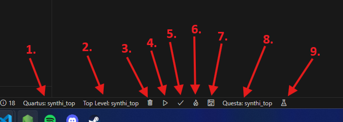
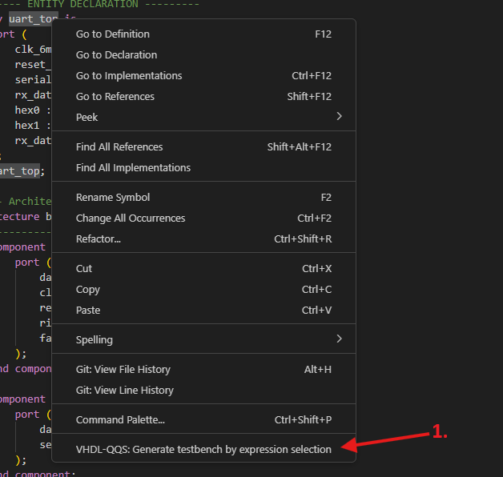
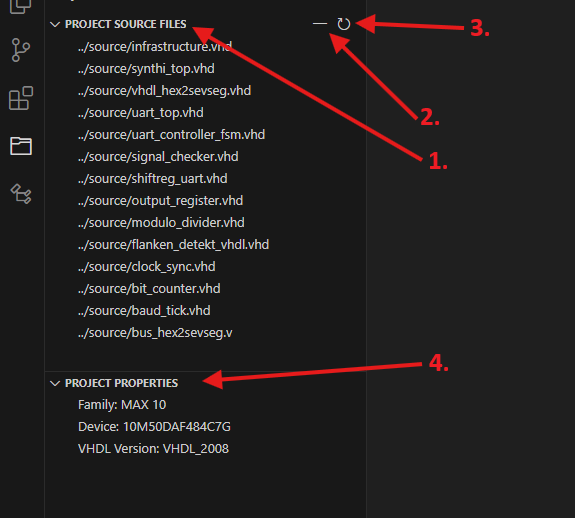

# Usage Examples

This section provides practical examples of how to use the VHDL-QQS extension to perform common FPGA development tasks. These examples demonstrate the key features and workflows, helping you get started quickly.

## Table of Contents

* [1. Project Management](#1-project-management)
    * [1.1 Selecting a Quartus Project](#11-selecting-a-quartus-project)
    * [1.2 Selecting a Questa Project](#12-selecting-a-questa-project)
    * [1.3 Adding/Removing Files from Project](#13-addingremoving-files-from-project)
* [2. Compilation and Programming](#2-compilation-and-programming)
    * [2.1 Compiling a Quartus Project](#21-compiling-a-quartus-project)
    * [2.2 Cleaning Compile Files](#22-cleaning-compile-files)
    * [2.3 Opening the FPGA Programmer](#23-opening-the-fpga-programmer)
    * [2.4 Opening the RTL Viewer](#24-opening-the-rtl-viewer)
    * [2.5 Changing the Top-Level Entity](#25-changing-the-top-level-entity)
* [3. Testbench Generation](#3-testbench-generation)
    * [3.1 Generating a Testbench](#31-generating-a-testbench)
    * [3.2 Generating a Testbench from Selection](#32-generating-a-testbench-from-selection)
* [4. Running Tests](#4-running-tests)
* [5. Manual Activation](#5-manual-activation)
* [6. VHDL-QQS Interface Elements](#6-vhdl-qqs-interface-elements)
    * [6.1 Status Bar Buttons](#61-status-bar-buttons)
    * [6.2 Context Menus](#62-context-menus)
    * [6.3 Quartus Project Explorer View](#63-quartus-project-explorer-view)
    * [6.4 Command Palette](#64-command-palette)
* [7. Use the formatter](#7-use-the-formatter)

## 1. Project Management

### 1.1 Selecting a Quartus Project

This example shows how to select a Quartus project for use with the extension.

* **Step 1: Open the Project Folder:** Open your Quartus project folder in VS Code.

* **Step 2: Select Project:** You have two options:
    * **Status Bar Button:** Click the project button in the status bar.
    * **Command Palette:** Use the "VHDL-QQS: Select quartus project" command in the command palette.

### 1.2 Selecting a Questa Project

This example shows how to select a Questa project for use with the extension.

* **Step 1: Open the Project Folder:** Open your Questa project folder in VS Code.

* **Step 2: Select Project:** You have two options:
    * **Status Bar Button:** Click the project button in the status bar.
    * **Command Palette:** Use the "VHDL-QQS: Select questa project" command in the command palette.

### 1.3 Adding/Removing Files from Project

These commands allow you to manage the files included in your project.

* **Adding a File:** Use the context menu when right-clicking on a VHDL or Verilog file in the VS Code explorer.
* **Removing a File:** Use the context menu when right-clicking on a VHDL or Verilog file in the VS Code explorer or use the minus icon in the "Project Source Files" view to select a file to remove.
* **Refreshing Source Files:** Use the refresh icon in the "Project Source Files" view to reload the list of source files.

## 2. Compilation and Programming

### 2.1 Compiling a Quartus Project

This example shows how to compile a Quartus project directly within VS Code.

* **Step 1: Select Project:** Ensure a Quartus project is selected (see section 1.1).

* **Step 2: Trigger Compilation:** You have two options:
    * **Command Palette:** Use the "VHDL-QQS: Compile quartus project" command.
    * **Status Bar Button:** Click the compile button (play icon) in the status bar.

* **Step 3: Observe Compilation Progress:** The compilation progress will be displayed in the VS Code terminal.

### 2.2 Cleaning Compile Files

This command cleans the Quartus output folder for the active project. Use the "VHDL-QQS: Clean quartus output folder" command in the command palette or use the clean output folder button (trash icon) in the status bar.

### 2.3 Opening the FPGA Programmer

This example shows how to open the Quartus FPGA programmer with the currently compiled project.

* **Step 1: Compile Project:** Ensure that the currently selected project has been compiled (see section 2.1).

* **Step 2: Open Programmer:** You have two options:
    * **Command Palette:** Use the "VHDL-QQS: Open programmer for active project" command.
    * **Status Bar Button:** Click the "Open Programmer" button (flame icon) in the status bar.

### 2.4 Opening the RTL Viewer

This example shows how to open the Quartus RTL Viewer for the currently compiled project.

* **Step 1: Compile Project:** Ensure that the currently selected project has been compiled (see section 2.1).

* **Step 2: Open RTL Viewer:** Use the "VHDL-QQS: Open RTL Viewer for active project" command in the command palette.

### 2.5 Changing the Top-Level Entity

This command allows you to change the top-level entity for the active Quartus project.

* **Step 1: Select Project:** Ensure a Quartus project is selected (see section 1.1).

* **Step 2: Change Top Level:** You have two options: 
    * **Command Palette:** Use the "VHDL-QQS: Change top level entity for active project" command in the command palette. You will be prompted to select the new top-level entity from a list.
    * **Status Bar Button:** Use the top level button in the status bar. You will be prompted to select the new top-level entity from a list.

## 3. Testbench Generation

### 3.1 Generating a Testbench

This example demonstrates how to generate a testbench for your entity using the extension.

* **Step 1: Open the Entity File:** Open the VHDL file for the entity you want to create a testbench for.

* **Step 2: Generate Testbench:** Use the "VHDL-QQS: Generate testbench by menu selection" command.

* **Step 3: View the Testbench:** The generated testbench file will be saved in the same folder as the original entity file.

    **Note:** The generated testbench provides a basic framework. You will need to modify it further to add more specific test cases and assertions.

### 3.2 Generating a Testbench from Selection

This command allows you to generate a testbench based on a selected piece of code, rather than the entire entity.

* **Step 1: Select Code:** Select the entity in the editor you want to generate a testbench for.

* **Step 2: Generate Testbench:**
    * **Context Menu:** Right-click within the selected code and choose "Generate Testbench".
    * **Command Palette:** Use the "VHDL-QQS: Generate testbench by expression selection" command.

## 4. Running Tests

This example shows how to run QuestaSim test script directly in VS Code.

* **Step 1: Select Project:** Ensure that you have a QuestaSim Project selected (see Section 1.2)

* **Step 2: Run Tests:** You have two options:
    * **Command Palette:** Use the "VHDL-QQS: Run Questa Tests" command.
    * **Status Bar Button:** Click the "Run questa tests" button (beaker icon) in the status bar.

## 5. Manual Activation

This command allows you to manually activate the extension. It's typically not needed as the extension should activate automatically based on the activation events. Use the "VHDL-QQS: Manually activate extension" command in the command palette.

## 6. VHDL-QQS Interface Elements

This section describes the buttons, menus, and views provided by the VHDL-QQS extension.

### 6.1 Status Bar Buttons

1. **Quartus Project Selection:** Allows you to select the active Quartus project.
2. **Top Level Selection:** Allows you to select the top level entity for current project.
3. **Clean Output Files:** (Trash icon) - Cleans the output files for the currently selected Quartus project.
4. **Compile:** (Play icon) - Compiles the currently selected Quartus project.
5. **Open Programmer:** (Flame icon) - Opens the Quartus programmer for the compiled project.
6. **Open RTL Viewer:** (PCB icon) - Opens the Quartus RTL Viewer for the compiled project.
5. **Questa Project Selection:** Allows you to select the active Questa project.
6. **Run Tests:** (Beaker icon) - Runs tests for the active questa project.

### 6.2 Context Menus

1. **Generate Testbench:** Available when right-clicking on an entity name or selected code in a VHDL file. Generates a testbench.
2. **Add File to Project:** Available when right-clicking on a VHDL or Verilog file in the VS Code explorer. Adds the file to the project.
3. **Remove File to Project:** Available when right-clicking on a VHDL or Verilog file in the VS Code explorer. Removes the file from the project.

### 6.3 Quartus Project Explorer View

1. **Project Source Files:** Displays the source files included in the current project. 
2. **Remove File Button:** Opens a selection to remove file from the current project.
3. **Refresh Files Button:** Refreshes the source file list for current project.
4. **Project Properties:** Displays properties of the active project.

### 6.4 Command Palette

All VHDL-QQS commands are accessible through the VS Code command palette (Ctrl+Shift+P or Cmd+Shift+P).  Just type "VHDL-QQS" to see all commands.

## 7. Use the formatter

This example shows how to format your VHDL source code using the extension.

* **Step 1: Open the File:** Open the VHDL file you want to format.

* **Step 2: Trigger Formatting:**
    * **Command Palette:** Open the command palette (Ctrl+Shift+P or Cmd+Shift+P) and run the "Format Document" command.

* **Step 3: Observe Formatting:** The file will be formatted according to VS Code's formatting settings.