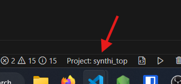
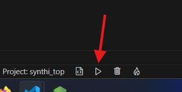
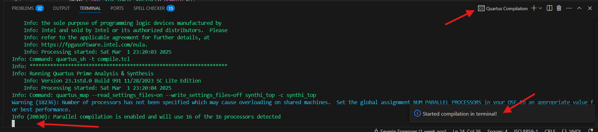
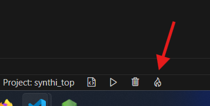
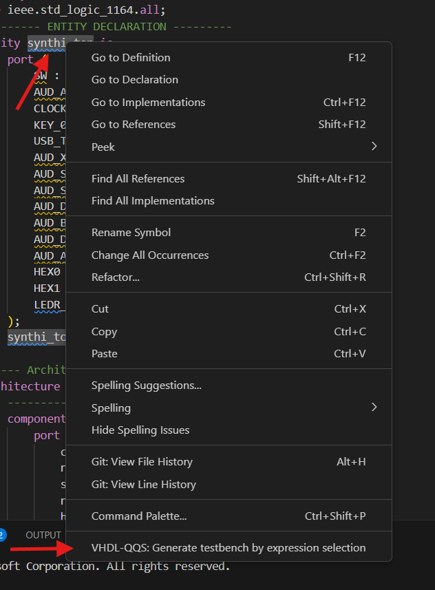

# Usage Examples

This section provides practical examples of how to use the VHDL-QQS extension to perform common FPGA development tasks. These examples demonstrate the key features and workflows, helping you get started quickly.

## 1. Compiling a Quartus Project

This example shows how to compile a Quartus project directly within VS Code.

* **Step 1: Open the Project Folder:** Open your Quartus project folder in VS Code.

* **Step 2: Select Project:** Select a project by clicking the Project button in the status bar.  *(See screenshot below)*

    

* **Step 3: Trigger Compilation:** You have two options:
    * **Command Palette:** Open the command palette (Ctrl+Shift+P or Cmd+Shift+P) and type "VHDL-QQS: Compile quartus project".
    * **Status Bar Button:** Click the compile button (play icon) in the status bar. *(See screenshot below)*

    

* **Step 4: Observe Compilation Progress:** The compilation progress will be displayed in the VS Code terminal.  *(See screenshot below)*

    

## 2. Opening the FPGA Programmer

This example shows how to open the Quartus FPGA programmer with the currently compiled project.

* **Step 1: Compile Project:** Ensure that the currently selected project has been compiled. If it hasn't been, follow the steps in the "Compiling a Quartus Project" section.

* **Step 2: Open Programmer:** You have two options:
    * **Command Palette:** Open the command palette (Ctrl+Shift+P or Cmd+Shift+P) and type "VHDL-QQS: Open programmer for active project".
    * **Status Bar Button:** Click the "Open Programmer" button (flame icon) in the status bar. *(See screenshot below)*

    

## 3. Generating a Testbench for QuestaSim

This example demonstrates how to generate a testbench for your entity using the extension.

* **Step 1: Open the Entity File:** Open the VHDL file for the entity you want to create a testbench for.

* **Step 2: Generate Testbench:** You have two options:
    * **Context Menu:** Right-click on the entity name in the code editor and select "Generate Testbench" from the context menu. *(See screenshot below)*

    

    * **Command Palette:** Open the command palette (Ctrl+Shift+P or Cmd+Shift+P) and type "VHDL-QQS: Generate testbench by menu selection".

* **Step 3: View the Testbench:** The generated testbench file will be saved in the `testbenches` directory of your project. You can then open and edit the testbench file.